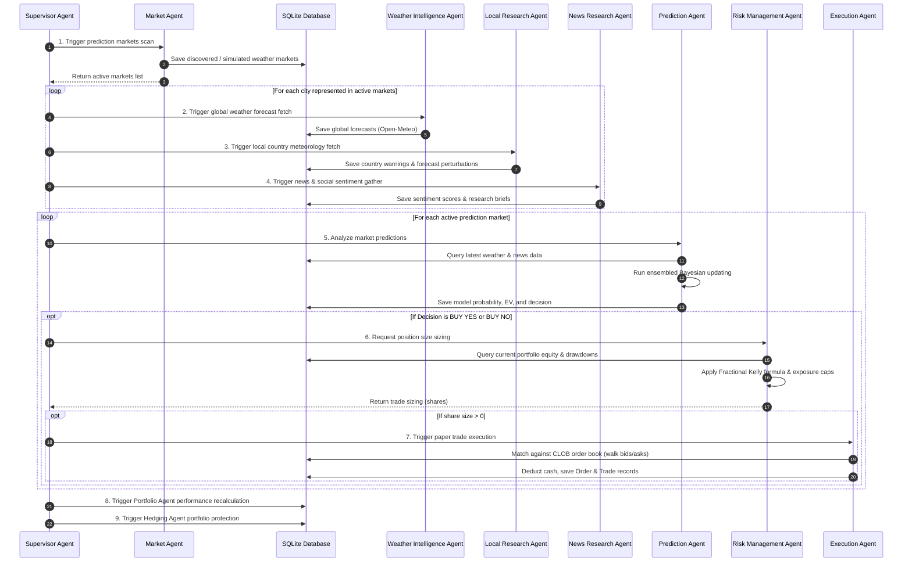

# Multi-Agent Workflow Sequence

This document describes how the AETHER agents interact and execute the end-to-end trading loop.

## Workflow Sequence

The Supervisor Agent orchestrates execution. The pipeline is designed to be triggered periodically (e.g., hourly) or run on demand via the API or CLI.

## Error Recovery & Fail-safes
- **LLM Outage/Limit Fallbacks**: If OpenRouter calls fail, the `BaseAgent` retries 3 times using exponential backoff, and automatically cycles through fallback models (Gemma-2, Mistral, Llama-3). If all fail, it falls back to deterministic model-driven reasoning to prevent workflow disruption.
- **Data Scraper Failures**: If meteorological APIs fail, the `WeatherService` generates historical/monsoon-calibrated climatological forecasts, ensuring the prediction pipeline never crashes.
- **Risk Circuit Breakers**: Position sizing calculation automatically returns `0` shares if daily portfolio drawdowns exceed 5% or if cumulative drawdown exceeds 20%.
