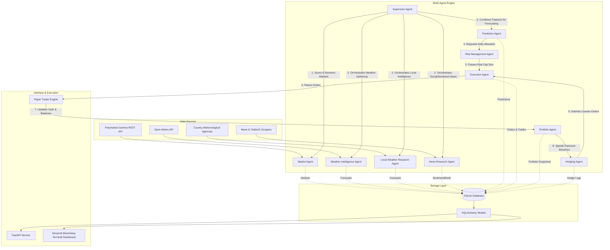

# Architecture & Multi-Agent Design

This document details the architecture and agent interaction patterns for AETHER — the Weather Prediction AI Trading Agent.

## Overall System Architecture

The platform follows a decoupled, data-driven architecture. The core multi-agent system runs as an asynchronous pipeline orchestrated by the Supervisor Agent, persisting state to SQLite database tables via SQLAlchemy. The presentation layer (Streamlit Terminal Dashboard) and Web API (FastAPI) query this persistent state in real-time.

---

## The 10 Hermes Agents

Each agent is built on top of a common `BaseAgent` class implementing persistent logging, OpenRouter LLM interface, multi-model fallbacks (Gemini, Gemma, Mistral, Llama), and auto-recovery error handlers.

1. **Supervisor Agent**: Orchestrates and schedules the entire pipeline sequence, handles failures/retries, and triggers automated end-of-day market resolutions based on actual weather reports.
2. **Weather Intelligence Agent**: Fetches global weather forecasts (7-day ahead arrays) and identifies climate anomalies.
3. **Local Weather Research Agent**: Collects country-specific meteorological agency reports (NOAA for US, BOM for Australia, IMD for India, Met Office for UK, JMA for Japan) and identifies severe storm/temperature alerts.
4. **Market Agent**: Discovers active prediction markets on Polymarket and tracks bids, asks, historical odds, volume, and liquidity depth.
5. **Research Agent**: Scrapes social media and meteorological feeds for real-time sentiment signals.
6. **Prediction Agent**: Combines forecast models, alerts, and sentiment to perform probabilistic event calculations.
7. **Risk Management Agent**: Sizes positions using the Kelly Criterion and fractional Kelly factors.
8. **Execution Agent**: Interfaces with the high-fidelity Paper Trader order book matching engine.
9. **Portfolio Agent**: Audits returns, win rates, Sharpe/Sortino ratios, and drawdowns.
10. **Hedging Agent**: Protects equity by placing offsetting cross-market or YES/NO contract hedges.
