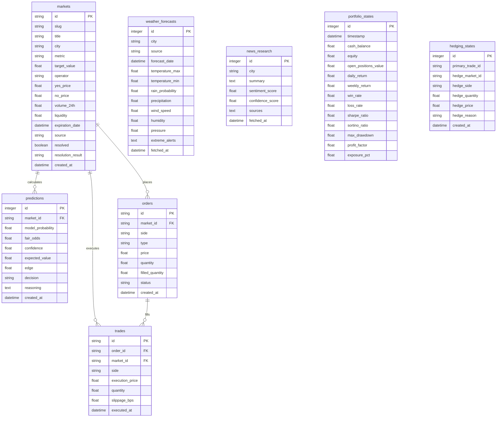

# Database Architecture

This document describes the database tables and SQLAlchemy schemas used in the AETHER system.

## SQLite Schema Diagram

```mermaid
erDiagram
    markets {
        string id PK
        string slug
        string title
        string city
        string metric
        float target_value
        string operator
        float yes_price
        float no_price
        float volume_24h
        float liquidity
        datetime expiration_date
        string source
        boolean resolved
        string resolution_result
        datetime created_at
    }

    weather_forecasts {
        integer id PK
        string city
        string source
        datetime forecast_date
        float temperature_max
        float temperature_min
        float rain_probability
        float precipitation
        float wind_speed
        float humidity
        float pressure
        text extreme_alerts
        datetime fetched_at
    }

    news_research {
        integer id PK
        string city
        text summary
        float sentiment_score
        float confidence_score
        text sources
        datetime fetched_at
    }

    predictions {
        integer id PK
        string market_id FK
        float model_probability
        float fair_odds
        float confidence
        float expected_value
        float edge
        string decision
        text reasoning
        datetime created_at
    }

    orders {
        string id PK
        string market_id FK
        string side
        string type
        float price
        float quantity
        float filled_quantity
        string status
        datetime created_at
    }

    trades {
        string id PK
        string order_id FK
        string market_id FK
        string side
        float execution_price
        float quantity
        float slippage_bps
        datetime executed_at
    }

    portfolio_states {
        integer id PK
        datetime timestamp
        float cash_balance
        float equity
        float open_positions_value
        float daily_return
        float weekly_return
        float win_rate
        float loss_rate
        float sharpe_ratio
        float sortino_ratio
        float max_drawdown
        float profit_factor
        float exposure_pct
    }

    hedging_states {
        integer id PK
        string primary_trade_id
        string hedge_market_id
        string hedge_side
        float hedge_quantity
        float hedge_price
        string hedge_reason
        datetime created_at
    }

    markets ||--o{ predictions : calculates
    markets ||--o{ orders : places
    markets ||--o{ trades : executes
    orders ||--o{ trades : fills
```
